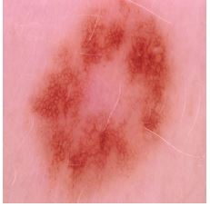
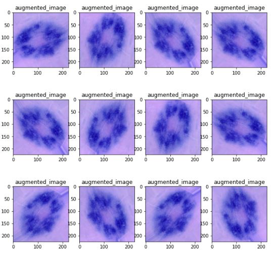
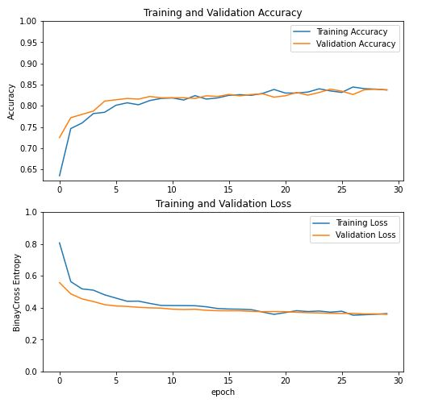
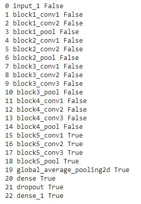
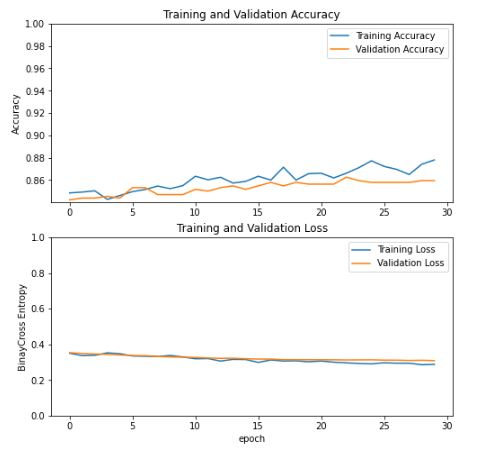
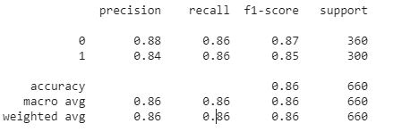

# Skin Cancer: Malignant vs. Benign
A machine learning model was built for skin cancer classification: Malignant vs Benign, using a convolutional neural network (CNN). The concepts of transfer learning and data augmentation was used to improve the accuracy of the model with less sample available.

## Dataset
. Kaggle - https://www.kaggle.com/fanconic/skin-cancer-malignant-vs-benign

. It is a balanced dataset with two different classes - maligant and benign. 

. The total training set is 2637. Out of which 1440 are benign and 1197 are malignant.

. The total test set is 660. Out of which 360 are benign and 300 are malignant.

## Data Augmentation
Augmentations applied on images are -

. horizontal_flip = True

. vertical_flip = True

. rotation_range= 60

. fill_mode='nearest'
### Orginal Image without Augmentation

### Augmented Image 

## Base Model from Pre-Trained Model

VGG16 pre-trained model is used which is trained on Imagenet dataset.

### Learning Curves for Base Model

### Base Model Performance

. Accuracy - 0.84

. Specificity/True_Negative_Rate - 0.83

. Sensitivity/True_Positive_Rate - 0.84

## Fine Tunned Model

Model was fine tunned from layer 15th.

### Learning Curves

. The accuracy of the fine tunned model will start from the base model accuracy which is 0.84. That's the reason why we are seeing a learning curve starting around 0.84 for the fine tunned model. 

. The validation loss will start from 0.36 and will decrease to 0.31.

### Fine Tunned Model Performance

. Accuracy - 0.86

. Specificity/True_Negative_Rate - 0.86

. Sensitivity/True_Positive_Rate - 0.86

## Conclusion

. With the technique like transfer learning and data augmentation, we can achieve significant accuracy with the fewer data without overfitting our model.

. Model accuracy increased from 0.84 to 0.86.

## Reference
https://www.tensorflow.org/tutorials/images/transfer_learning

 
